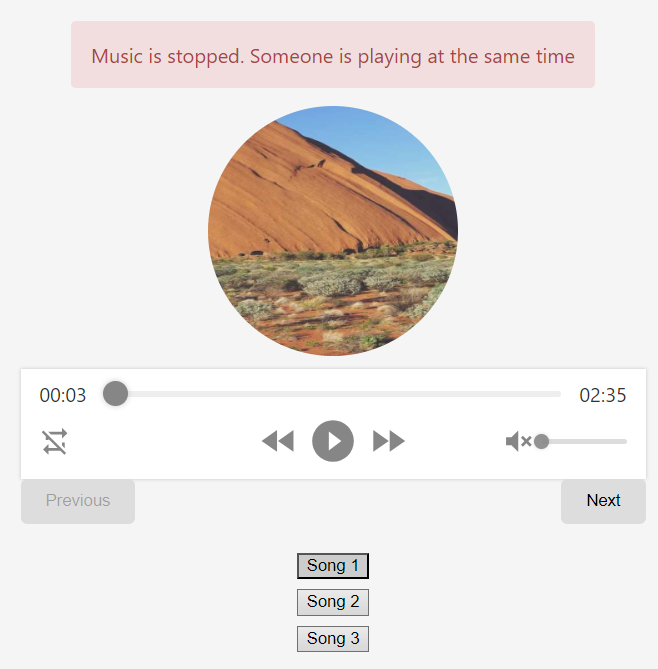
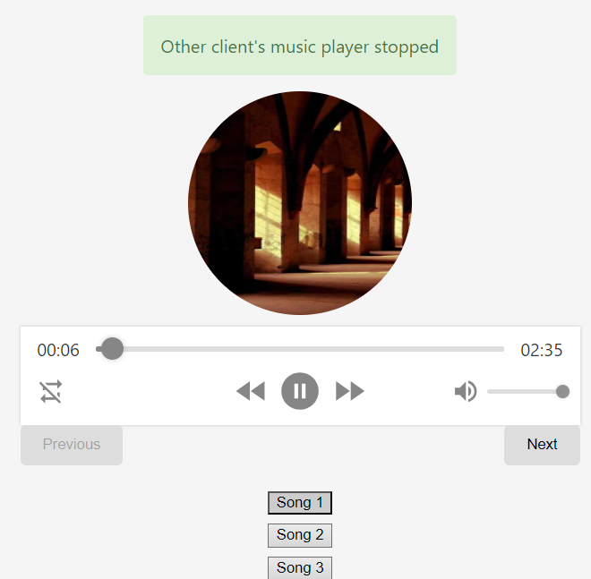

# Spring Boot Music Player with Real-time Social Functionality
This project implements a music player application with social features using Spring Boot for the backend and React with websockets for the frontend. It allows users to:
- Login with email and password
- Potentially share music playback control (only one user can play at a time per account)

## Technology Stack:
- Backend: Spring Boot
- Frontend: React
- Websockets: React Stomp Hooks (Frontend) and Spring Boot Websocket (Backend)
## Key Features:
- User login/authentication
- Real-time communication between clients using websockets
- Potential social music playback control
## Current Functionality:
- Users can login with email and password.
- If two clients connect with the same account, only one can play music at a time. When one client starts playing, the other client's music is stopped.
## Screenshots:
- #### When two client try to play at the same time with same account:



## Spring Boot Websocket Controller:
```java 
@Autowired
    private SimpMessagingTemplate messagingTemplate;
    private final Map<String, String> playbackSessions = new HashMap<>();
    @MessageMapping("/play")
    public void play(@Payload String message, @Header("sessionID") String sessionId) {
        synchronized (playbackSessions) {
            String previousSessionId = playbackSessions.get(message);
            if (previousSessionId != null) {
                messagingTemplate.convertAndSend("/queue/reply-" + previousSessionId,
                        "paused");
                messagingTemplate.convertAndSend("/queue/reply-" + sessionId,
                        "paused message");
                playbackSessions.remove(message);
            }
            playbackSessions.put(message, sessionId);
        }
        messagingTemplate.convertAndSend("/queue/reply-" + sessionId,
                "played");
    }
    @MessageMapping("/pause")
    public void pause(@Payload String message, @Header("sessionID") String sessionId) {
        playbackSessions.remove(message);
    }
```

## Getting Started:
1. Clone the repository: ```git clone https://github.com/yasinunl/musicplatformapi.git```
1. Run the Spring Boot application
1. Add a new user with Postman
1. Start the React development server 
1. Access the application in your web browser (http://localhost:3000).

### Additional Note
- Please check the Music Platform API
- Check App.js and MusicPlayer.js
